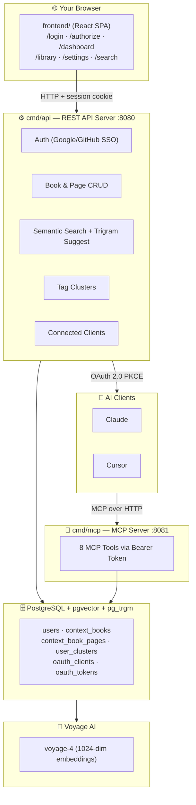

# ContextBook

> Persistent semantic memory for AI tools, built on the Model Context Protocol.

ContextBook is an open-source MCP server that gives AI tools (Claude, Cursor, Windsurf, etc.) long-term memory. Push context as **Books** and **Pages**, then semantically search across it — all powered by PostgreSQL + pgvector, pg_trgm, and Voyage AI embeddings.

## How It Works



Two Go binaries share the same Postgres database:

- **`cmd/api`** (`:8080`) — The control plane. Handles user login, OAuth 2.0 PKCE flows for MCP client registration, session management, book and page CRUD, semantic search, trigram suggestions, tag clusters, and client management.
- **`cmd/mcp`** (`:8081`) — The data plane. Exposes 8 MCP tools protected by Bearer token auth, with pgvector-powered semantic search.

## MCP Tools

All tools require a valid Bearer token and are scoped to the authenticated user.

| Tool | Description |
|------|-------------|
| `create_or_update_book` | Create a Book or update its metadata; returns `book_id` |
| `insert_page` | Push an atomic page into a Book; embeds immediately and stores real `token_count` |
| `update_page` | Replace a page's content by `book_id` + `page_index`; re-embeds |
| `delete_page` | Remove a page (indices are not re-numbered after deletion) |
| `list_books` | Paginated list of Book metadata (no content) |
| `get_book` | Retrieve all pages of a Book ordered by page index |
| `search_pages` | Semantic search across all Books; returns matching pages with cosine similarity |
| `readme` | Returns the ContextBook usage guide; call once per session |

**Knowledge model:** A **Book** is a metadata container (title, source, tags). A **Page** is an atomic content chunk with a `VOYAGE_DIMENSION`-dim embedding (default 1024) and a real `token_count` from the Voyage API. Pages are addressed by composite key: `book_id` + `page_index`.

## Quick Start

### Prerequisites

- Go 1.26+
- Node.js 22+
- PostgreSQL 16+ with [pgvector](https://github.com/pgvector/pgvector) and `pg_trgm` extensions
- A [Voyage AI](https://www.voyageai.com/) API key

### 1. Set up the database

Create a PostgreSQL database with the required extensions:

```sql
CREATE DATABASE contextbook_db;
\c contextbook_db
CREATE EXTENSION IF NOT EXISTS vector;
CREATE EXTENSION IF NOT EXISTS pg_trgm;
```

Migrations (`001` through `005`) run automatically on API server startup — no manual step needed.

### 2. Configure environment

```bash
cp .env.example backend/.env
```

Edit `backend/.env` and set at minimum:

| Variable | Required | Description |
|----------|----------|-------------|
| `DATABASE_URL` | **Yes** | PostgreSQL connection string |
| `API_KEY_SALT` | **Yes** | HMAC secret for session cookies (generate a random string) |
| `VOYAGE_API_KEY` | **Yes** | Voyage AI API key for embeddings |

Optional OAuth credentials for SSO login:

| Variable | Description |
|----------|-------------|
| `GOOGLE_CLIENT_ID` / `GOOGLE_CLIENT_SECRET` | Google OAuth 2.0 credentials |
| `GITHUB_CLIENT_ID` / `GITHUB_CLIENT_SECRET` | GitHub OAuth App credentials |

See [`.env.example`](.env.example) for the full list of configuration options.

### 3. Run the backend

```bash
cd backend

# Start the API server (runs migrations, then serves on :8080)
go run ./cmd/api/main.go

# In another terminal, start the MCP server (:8081)
go run ./cmd/mcp/main.go
```

### 4. Run the frontend (optional, for dashboard)

```bash
cd frontend
# Copy env template (or create frontend/.env manually)
cp ../.env.example .env
npm install
npm run dev    # Vite dev server on :5173, proxies /api → :8080
```

### 5. Connect an AI client

For **Cursor**, add to `.cursor/mcp.json`:

```json
{
  "mcpServers": {
    "contextbook": {
      "url": "http://localhost:8081/mcp"
    }
  }
}
```

For **Claude Desktop** or any MCP-compatible client, point the server URL to `http://localhost:8081/mcp`. On first connection the client will register via Dynamic Client Registration (`POST /register`) and initiate the OAuth 2.0 PKCE flow through the browser.

### Reset the database (development)

```bash
cd backend
go run clean_db.go    # Drops all tables; restart the API server to re-run migrations
```

## Auth Flows

### Browser Session (Dashboard)

1. User clicks "Continue with Google/GitHub"
2. → OAuth callback → upserts user record → sets HMAC-SHA256 signed session cookie (7-day expiry)
3. Dashboard uses session cookie for all `/api/*` requests

### Bearer Token (MCP)

1. AI client calls `POST /register` (RFC 7591 Dynamic Client Registration) → gets `client_id`
2. Client initiates OAuth 2.0 PKCE → user approves (or denies) on `/authorize` consent screen
3. Auth code exchanged at `POST /token` → Bearer token issued (`cb_tok_` prefix, 30-day expiry)
4. Refresh tokens (`cb_refresh_` prefix, 90-day expiry) rotate on use
5. MCP server validates Bearer token on each request: hash with SHA-256, look up in DB, inject `userID`
6. Last-seen tracking is derived from `MAX(t.last_used_at)` across tokens per client

## API Reference

### REST API (`:8080`)

| Method | Path | Description |
|--------|------|-------------|
| `GET` | `/auth/google` | Initiate Google SSO |
| `GET` | `/auth/google/callback` | Google OAuth callback |
| `GET` | `/auth/github` | Initiate GitHub SSO |
| `GET` | `/auth/github/callback` | GitHub OAuth callback |
| `POST` | `/api/auth/logout` | Clear session cookie |
| `GET` | `/api/me` | Get current user profile |
| `PATCH` | `/api/me` | Update display name |
| `GET` | `/api/books` | List books with pagination, sorting, and previews |
| `POST` | `/api/books` | Create a new book |
| `GET` | `/api/books/{id}` | Get a book with all pages |
| `PUT` | `/api/books/{id}` | Update book metadata |
| `DELETE` | `/api/books/{id}` | Delete a book |
| `POST` | `/api/books/{id}/pages` | Insert a new page |
| `PUT` | `/api/books/{id}/pages/{index}` | Update a page |
| `DELETE` | `/api/books/{id}/pages/{index}` | Delete a page |
| `POST` | `/api/search` | Semantic search (query embedding + cosine similarity) |
| `GET` | `/api/search/suggest` | Trigram text search suggestions |
| `GET` | `/api/books/{id}/related` | Semantically related books |
| `GET` | `/api/clusters` | List user clusters |
| `POST` | `/api/clusters` | Create a cluster |
| `PUT` | `/api/clusters/{id}` | Update a cluster |
| `DELETE` | `/api/clusters/{id}` | Delete a cluster |
| `GET` | `/api/clients` | List connected MCP clients |
| `DELETE` | `/api/clients/{id}` | Disconnect/revoke a client |
| `GET` | `/api/tokens` | List active tokens/clients (last-seen tracked) |
| `POST` | `/api/tokens/revoke` | Revoke a specific token |
| `GET` | `/api/oauth/authorize-info` | Load consent screen data |
| `POST` | `/api/oauth/authorize-approve` | Submit consent → issue auth code |
| `POST` | `/api/oauth/authorize-deny` | Deny OAuth authorization |
| `POST` | `/token` | Exchange auth code for access + refresh tokens |
| `POST` | `/token/refresh` | Rotate refresh token → new access token |
| `POST` | `/register` | Dynamic Client Registration (RFC 7591) |
| `POST` | `/revoke` | Token self-revocation (RFC 7009) |
| `GET` | `/.well-known/oauth-authorization-server` | RFC 8414 Authorization Server Metadata |
| `GET` | `/.well-known/oauth-protected-resource` | RFC 9728 Protected Resource Metadata |

### Frontend Routes

| Route | Purpose |
|-------|---------|
| `/login` | Google + GitHub OAuth buttons; auto-redirects if authenticated |
| `/authorize` | OAuth 2.0 consent screen for MCP clients (approve / deny) |
| `/dashboard` | Stats, quick actions, recent books, popular tags, AI client connections |
| `/library` | Browse all books: clusters, filters, sort, view modes, search bar |
| `/settings` | Profile, connected clients, installation info |
| `/search` | Semantic search landing page (redirects to ⌘K palette) |

## Configuration

All configuration is via environment variables (loaded from `backend/.env` via `godotenv`).

| Variable | Required | Default | Description |
|----------|----------|---------|-------------|
| `DATABASE_URL` | **Yes** | — | PostgreSQL connection string |
| `API_KEY_SALT` | **Yes** | — | HMAC secret for session cookies |
| `VOYAGE_API_KEY` | **Yes** | — | Voyage AI API key |
| `PORT` | No | `8080` | REST API / Auth server port |
| `MCP_PORT` | No | `8081` | MCP tool server port |
| `ENV` | No | `development` | Runtime environment |
| `PUBLIC_URL` | No | `http://localhost:$PORT` | Advertised OAuth resource URL |
| `FRONTEND_URL` | No | `http://localhost:5173` | CORS origin; OAuth redirect target |
| `COOKIE_DOMAIN` | No | — | Session cookie domain (set in production) |
| `VOYAGE_MODEL` | No | `voyage-4` | Embedding model name |
| `VOYAGE_DIMENSION` | No | `1024` | Embedding vector dimension |
| `GOOGLE_CLIENT_ID` | No | — | Google OAuth credentials |
| `GOOGLE_CLIENT_SECRET` | No | — | |
| `GITHUB_CLIENT_ID` | No | — | GitHub OAuth credentials |
| `GITHUB_CLIENT_SECRET` | No | — | |

> **Note:** Changing `VOYAGE_MODEL` requires a model that outputs exactly `VOYAGE_DIMENSION` dimensions. If you switch to a model with a different dimension, you must also alter the `embedding` column in the database and update `VOYAGE_DIMENSION`.

## Database Schema

Migrations run automatically on API server startup.

| Table | Purpose |
|-------|---------|
| `users` | SSO-linked user accounts (Google/GitHub) |
| `context_books` | Book metadata — title, source, tags, scoped to user |
| `context_book_pages` | Page content + `vector(1024)` embeddings with HNSW index + real `token_count` |
| `user_clusters` | User-defined tag groups for organizing books |
| `oauth_clients` | Registered MCP clients (RFC 7591) |
| `oauth_codes` | Short-lived PKCE authorization codes |
| `oauth_tokens` | SHA-256 hashed Bearer tokens (prefix `cb_tok_`) |
| `oauth_refresh_tokens` | Rotating refresh tokens (prefix `cb_refresh_`) |

**Migration files:**

| Migration | Description |
|-----------|-------------|
| `001_init.up.sql` | Base schema |
| `002_oauth_auth_requests.up.sql` | OAuth auth requests table |
| `003_trigram_search.up.sql` | `pg_trgm` extension + indexes for text search |
| `004_user_clusters.up.sql` | `user_clusters` table |
| `005_token_count.up.sql` | `token_count` column on `context_book_pages` |

## Project Structure

```
context-bridge/
├── backend/
│   ├── cmd/
│   │   ├── api/main.go              ← REST API + Auth server
│   │   └── mcp/main.go              ← MCP tool server
│   ├── config/config.go             ← Environment config
│   ├── clean_db.go                  ← Dev utility to reset the database
│   └── internal/
│       ├── api/                     ← REST route handlers (books, search, clusters, clients, me)
│       ├── auth/                    ← Session cookies, OAuth 2.0 PKCE, SSO
│       ├── context/                 ← Book/Page business logic + embedding
│       ├── db/                      ← pgx/v5 queries + migrations
│       │   └── migrations/
│       │       ├── 001_init.up.sql
│       │       ├── 002_oauth_auth_requests.up.sql
│       │       ├── 003_trigram_search.up.sql
│       │       ├── 004_user_clusters.up.sql
│       │       └── 005_token_count.up.sql
│       ├── embedding/               ← Voyage AI embeddings client
│       ├── mcp/                     ← 8 MCP tool handlers
│       └── logger/                  ← slog setup + HTTP access logging
├── frontend/                        ← Vite + React 19 + TypeScript SPA
│   ├── src/App.tsx                  ← Router + app shell
│   ├── src/components/
│   │   ├── Dashboard.tsx            ← Stats, quick actions, recent books, tags
│   │   ├── Library.tsx              ← Cluster strip, filters, sort, view modes
│   │   ├── DetailDrawer.tsx         ← Book detail, pages, related books
│   │   ├── CreateForm.tsx           ← Multi-page editor with draft auto-save
│   │   ├── CommandPalette.tsx       ← ⌘K semantic search
│   │   ├── Settings.tsx             ← Profile, clients, installation
│   │   ├── SearchBar.tsx            ← Trigram suggestion dropdown
│   │   ├── Sidebar.tsx              ← Navigation + source filters
│   │   ├── LoginPage.tsx            ← OAuth login
│   │   └── ...                      ← Cards, rows, compact rows, icons, etc.
│   └── src/index.css                ← Design system CSS
├── Context Bridge Frontend Sample/   ← Original UI prototype (design reference)
└── go.work                           ← Go workspace
```

## Tech Stack

| Layer | Technology | Why |
|-------|-----------|-----|
| Backend | Go 1.26 | Single static binary, fast, minimal memory |
| Database | PostgreSQL + pgvector + pg_trgm | Relational + vector + fast text search in one store |
| Embeddings | Voyage AI (`voyage-4`, 1024-dim) | High-quality embeddings; easily swappable |
| MCP SDK | `modelcontextprotocol/go-sdk` | Official Go MCP implementation |
| Auth | HMAC cookies + OAuth 2.0 PKCE | Stateless sessions; PKCE for public clients |
| Frontend | React 19 + Vite + TypeScript | Fast dev iteration, rich interactive UI |

## Contributing

1. Fork the repository
2. Create a feature branch (`git checkout -b feature/my-feature`)
3. Make your changes
4. Ensure the backend compiles (`cd backend && go build ./cmd/api ./cmd/mcp`)
5. Ensure the frontend builds (`cd frontend && npm run build`)
6. Commit and push
7. Open a Pull Request

## License

This project is licensed under the MIT License — see the [LICENSE](LICENSE) file for details.
