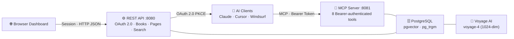

# ContextBook

[](https://smithery.ai/servers/context-book/connect)

**Stop re-explaining yourself to Agents. Give it the right context, right when needed.**

LLMs are stateless — each conversation starts from scratch. ContextBook gives your AI tools a persistent, searchable knowledge library to draw the right context when they need it. No bloatware, no pre-loaded junk. Just the right information, at the right time.

## How It Works


```mermaid
flowchart LR
    AI["🤖 AI Clients\nClaude · Cursor · Windsurf"]
    Browser["🌐 Browser Dashboard"]
    MCP["🔌 MCP Server :8081\n8 Bearer-authenticated tools"]
    API["⚙️ REST API :8080\nOAuth 2.0 · Books · Pages · Search"]
    DB["🗄️ PostgreSQL\npgvector · pg_trgm"]
    VOYAGE["🧠 Voyage AI\nvoyage-4 (1024-dim)"]

    AI -- "MCP · Bearer Token" --> MCP
    Browser -- "Session · HTTP JSON" --> API
    MCP --- DB
    API --- DB
    API -- "OAuth 2.0 PKCE" --> AI
    DB --- VOYAGE
```

Two Go binaries share a PostgreSQL database:

- **API server** (`cmd/api`) — the control plane: user login, OAuth 2.0, dashboard, book/page CRUD
- **MCP server** (`cmd/mcp`) — the data plane: 8 MCP tools for AI agents, protected by Bearer tokens

## MCP Tools

All tools require a valid Bearer token and are scoped to the authenticated user.

| Tool | Description |
|------|-------------|
| `book_create_or_update` | Create a Book or update its metadata |
| `book_list` | Paginated list of Book metadata |
| `book_get` | Retrieve all pages of a Book |
| `page_insert` | Push an atomic page into a Book; embeds immediately |
| `page_update` | Replace a page's content; re-embeds |
| `page_delete` | Remove a page (indices not re-numbered) |
| `page_search` | Semantic search across all Books |
| `readme` | Returns the usage guide (call once per session) |

## Quick Start

### Prerequisites

- Go 1.26+
- Node.js 22+
- PostgreSQL 16+ with [pgvector](https://github.com/pgvector/pgvector) and `pg_trgm`
- A [Voyage AI](https://www.voyageai.com/) API key

### 1. Set up the database

```sql
CREATE DATABASE contextbook_db;
\c contextbook_db
CREATE EXTENSION IF NOT EXISTS vector;
CREATE EXTENSION IF NOT EXISTS pg_trgm;
```

Migrations run automatically on API server startup.

### 2. Configure environment

```bash
cp .env.example backend/.env
# Edit backend/.env — set DATABASE_URL, API_KEY_SALT, VOYAGE_API_KEY
```

### 3. Run the backend

```bash
cd backend
go run ./cmd/api/main.go    # API + dashboard (:8080)
go run ./cmd/mcp/main.go     # MCP server (:8081)
```

### 4. Run the frontend (optional)

```bash
cd frontend
npm install && npm run dev    # Vite dev server on :5173
```

### 5. Connect an AI client

For **Cursor** (`.cursor/mcp.json`):

```json
{
  "mcpServers": {
    "contextbook": {
      "url": "http://localhost:8081/mcp"
    }
  }
}
```

For any MCP-compatible client, point the server URL to `http://localhost:8081/mcp`.

## Documentation

- [Backend README](backend/README.md) — API routes, auth flows, database schema, MCP tools, configuration
- [Frontend README](frontend/README.md) — components, routing, design system, development setup
- [Architecture](architecture.md) — full system overview with Mermaid diagrams

## Project Structure

```
context-book/
├── backend/
│   ├── cmd/api/main.go          REST API + auth server
│   ├── cmd/mcp/main.go          MCP tool server
│   └── internal/
│       ├── api/                  REST handlers + routes
│       ├── auth/                 OAuth 2.0 PKCE, sessions, SSO
│       ├── context/              Book/Page business logic
│       ├── db/                  pgx queries + migrations
│       ├── embedding/            Voyage AI client
│       ├── logger/               slog + HTTP access logging
│       └── mcp/                  8 MCP tool handlers
├── frontend/                     React 19 + Vite + TypeScript SPA
│   └── src/
│       ├── App.tsx               Router + app shell
│       ├── lib/api.ts            HTTP client
│       └── components/           UI components
├── Dockerfile                    API server container
├── Dockerfile.mcp                MCP server container
└── go.work                       Go workspace
```

## Contributing

1. Fork the repository
2. Create a feature branch (`git checkout -b feature/my-feature`)
3. Make your changes
4. Ensure the backend compiles (`cd backend && go build ./cmd/api ./cmd/mcp`)
5. Ensure the frontend builds (`cd frontend && npm run build`)
6. Commit and push
7. Open a Pull Request

## License

MIT — see the [LICENSE](LICENSE) file for details.
