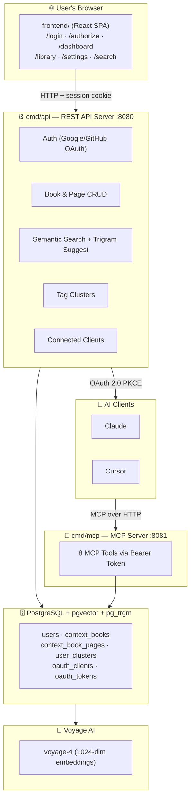

# ContextBook — Architecture

## System Overview

ContextBook is a personal AI memory store. AI tools (Claude, Cursor) connect over MCP to push and retrieve context. Users manage their library through a rich web dashboard with semantic search, tag clusters, and real-time stats. All data is stored in PostgreSQL with pgvector for semantic search and pg_trgm for fast text suggestions.



---

## Services

### `cmd/api` — REST API Server (`:8080`)

The "control plane". Handles everything user-facing and security-critical.

**Responsibilities:**
- Runs all DB migrations on startup (`001` through `005`)
- Google and GitHub OAuth 2.0 SSO login
- HMAC-SHA256 signed session cookies (7-day expiry)
- OAuth 2.0 PKCE flows for AI client registration and token issuance
- Dynamic Client Registration (RFC 7591) at `POST /register` with rate limiting (max 1000/hr, localhost exempt)
- Book and Page CRUD with real `token_count` and `page_count`
- Semantic search (`POST /api/search`) and trigram text suggestions (`GET /api/search/suggest`)
- User-defined tag clusters (`/api/clusters`)
- Connected MCP client list and disconnect (`/api/clients`)
- Well-known discovery endpoints (`/.well-known/oauth-authorization-server`, `/.well-known/oauth-protected-resource`)
- CORS permissive headers for browser-based MCP connectors

**Key routes:**

| Method | Path | Purpose |
|--------|------|---------|
| `GET` | `/auth/google` | Initiate Google SSO |
| `GET` | `/auth/google/callback` | Google OAuth callback |
| `GET` | `/auth/github` | Initiate GitHub SSO |
| `GET` | `/auth/github/callback` | GitHub OAuth callback |
| `POST` | `/api/auth/logout` | Clear session cookie |
| `GET` | `/api/me` | Get current user profile |
| `PATCH` | `/api/me` | Update display name |
| `GET` | `/api/books` | List books (pagination, sorting, previews) |
| `POST` | `/api/books` | Create a new book |
| `GET` | `/api/books/{id}` | Get book with all pages |
| `PUT` | `/api/books/{id}` | Update book metadata |
| `DELETE` | `/api/books/{id}` | Delete a book |
| `POST` | `/api/books/{id}/pages` | Insert a new page |
| `PUT` | `/api/books/{id}/pages/{index}` | Update page content |
| `DELETE` | `/api/books/{id}/pages/{index}` | Delete a page |
| `POST` | `/api/search` | Semantic search (embeds query, cosine similarity) |
| `GET` | `/api/search/suggest` | Trigram text search suggestions |
| `GET` | `/api/books/{id}/related` | Semantically related books |
| `GET` | `/api/clusters` | List user clusters |
| `POST` | `/api/clusters` | Create a cluster |
| `PUT` | `/api/clusters/{id}` | Update a cluster |
| `DELETE` | `/api/clusters/{id}` | Delete a cluster |
| `GET` | `/api/clients` | List connected MCP clients |
| `DELETE` | `/api/clients/{id}` | Disconnect/revoke a client |
| `GET` | `/api/tokens` | List active tokens/clients (last-seen tracked) |
| `POST` | `/api/tokens/revoke` | Revoke a specific token by hash |
| `GET` | `/api/oauth/authorize-info` | Load consent screen data |
| `POST` | `/api/oauth/authorize-approve` | Submit consent → issue auth code |
| `POST` | `/api/oauth/authorize-deny` | Deny OAuth authorization |
| `POST` | `/token` | Exchange auth code for Bearer token (PKCE) |
| `POST` | `/token/refresh` | Rotate refresh → new access token |
| `POST` | `/register` | Dynamic Client Registration |
| `POST` | `/revoke` | RFC 7009 token self-revocation |
| `GET` | `/.well-known/oauth-*` | PRM/AS discovery metadata |

---

### `cmd/mcp` — MCP Tool Server (`:8081`)

The "data plane". Only MCP-speaking AI clients talk to this server.

**Responsibilities:**

- Validates Bearer tokens on every request (`auth.Middleware`)
- Injects `userID` into `context.Context` via `auth.CheckAuth(ctx)`
- Routes MCP tool calls to handlers
- Calls embedding API to convert text → `VOYAGE_DIMENSION`-dim vectors (default 1024)
- Queries pgvector with cosine similarity (HNSW index)

**8 MCP Tools:**

| Tool | Operation |
|------|-----------|
| `create_or_update_book` | Upsert a Book (context container) by `book_id` |
| `insert_page` | Append a page + embed immediately; stores real `token_count` |
| `update_page` | Replace a page's content by `book_id` + `page_index` + re-embed |
| `delete_page` | Remove a page (gaps in indices are normal) |
| `list_books` | Paginated Book metadata list |
| `get_book` | All pages of a Book in order |
| `search_pages` | Semantic search across all Books (cosine similarity) |
| `readme` | Returns the usage guide; call once per session |

---

### `frontend/` — React SPA (`:5173` dev)

A Vite + React 19 + TypeScript single-page app. The original design prototype has been fully integrated into the Vite project.

**Routes:**

| Route | Purpose |
|-------|---------|
| `/login` | Google + GitHub OAuth buttons; auto-redirects if already authenticated |
| `/authorize` | OAuth 2.0 consent screen (shown when an AI client requests access) with **Approve** and **Deny** actions |
| `/dashboard` | Real-time stats (MCP client count, sources, contexts), quick actions, recent books, popular tags, connected AI clients card |
| `/library` | Cluster strip (user-defined tag groups), filter by source, sort (recent/title/size), view modes (cards/rows/compact), search bar with trigram suggestions |
| `/settings` | General settings (display name), Clients (list + disconnect), Installation (MCP endpoint copy) |
| `/search` | Landing page redirecting users to the ⌘K command palette for semantic search |

**Key UI components:**

| Component | Feature |
|-----------|---------|
| `Dashboard.tsx` | Stats, quick actions, recent contexts, popular tags, AI clients |
| `Library.tsx` | Cluster strip, source filter, sort, view modes, search bar |
| `DetailDrawer.tsx` | Book metadata, expand/collapse pages, per-page copy, global Markdown copy, semantically related books, page focus on open |
| `CreateForm.tsx` | Multi-page editor, auto-save draft to `localStorage`, edit existing books |
| `CommandPalette.tsx` | ⌘K semantic search via `POST /api/search`, page-level results with page numbers, relevance bars, opens book at specific page |
| `Settings.tsx` | General (display name), Clients (list + disconnect), Installation (MCP endpoint copy) |
| `SearchBar.tsx` | Trigram suggestion dropdown, keyboard nav, click opens library + detail drawer |

**API client:** `fetch` with `credentials: 'include'` (session cookie). In dev, Vite proxies `/api/*` to `:8080`.

**Design system:** Hand-crafted CSS in `src/index.css`. Dark theme (`#0c0b0a` background), amber accent (`#e8b765`), Cormorant Garamond + JetBrains Mono fonts, Lucide icons. Three view modes: cards / rows / compact. Collapsible sidebar. Keyboard-first (⌘K, `/`, `N`).

---

### `Context Bridge Frontend Sample/` — UI Design Prototype (reference)

The original rich UI mockup written as raw JSX loaded from CDN. It served as the design reference for the frontend rewrite and is now fully realized inside the Vite React project above.

---

## Data Model

```
users
  id            UUID PK
  email         TEXT NOT NULL
  display_name  TEXT NOT NULL
  avatar_url    TEXT
  provider      TEXT NOT NULL   (google | github)
  provider_id   TEXT NOT NULL
  created_at    TIMESTAMPTZ

context_books
  id            UUID PK
  user_id       UUID FK → users
  title         TEXT NOT NULL
  source        TEXT NOT NULL
  tags          TEXT[]
  created_at    TIMESTAMPTZ
  updated_at    TIMESTAMPTZ

context_book_pages
  id            UUID PK
  book_id       UUID FK → context_books
  user_id       UUID FK → users
  page_index    INT NOT NULL    ← UNIQUE(book_id, page_index)
  content       TEXT NOT NULL
  token_count   INT             ← real usage.total_tokens from Voyage API
  embedding     vector(1024)   ← HNSW cosine index
  created_at    TIMESTAMPTZ
  updated_at    TIMESTAMPTZ

user_clusters
  id            UUID PK
  user_id       UUID FK → users
  name          TEXT NOT NULL
  tag           TEXT NOT NULL
  created_at    TIMESTAMPTZ

oauth_clients
  client_id     TEXT PK
  name          TEXT NOT NULL
  redirect_uris TEXT[]
  created_at    TIMESTAMPTZ

oauth_codes
  code                TEXT PK
  client_id           TEXT FK → oauth_clients
  user_id             UUID FK → users
  redirect_uri        TEXT
  code_challenge       TEXT NOT NULL
  code_challenge_method TEXT NOT NULL
  expires_at          TIMESTAMPTZ
  created_at          TIMESTAMPTZ

oauth_tokens
  token         TEXT PK        ← SHA-256 of raw token (prefix: cb_tok_)
  client_id     TEXT FK → oauth_clients
  user_id       UUID FK → users
  expires_at    TIMESTAMPTZ
  last_used_at  TIMESTAMPTZ
  created_at    TIMESTAMPTZ

oauth_refresh_tokens
  token               TEXT PK        ← SHA-256 of raw token (prefix: cb_refresh_)
  access_token_hash   TEXT UNIQUE FK → oauth_tokens(token)
  client_id            TEXT FK → oauth_clients
  user_id              UUID FK → users
  expires_at           TIMESTAMPTZ
  created_at           TIMESTAMPTZ
```

**Migrations** (run automatically on API server startup via `golang-migrate`):

| File | Purpose |
|------|---------|
| `001_init.up.sql` | Base schema: users, context_books, context_book_pages, oauth_* tables |
| `002_oauth_auth_requests.up.sql` | OAuth auth requests table |
| `003_trigram_search.up.sql` | `pg_trgm` extension + GIN indexes for text search suggestions |
| `004_user_clusters.up.sql` | `user_clusters` table for user-defined tag grouping |
| `005_token_count.up.sql` | `token_count` column on `context_book_pages` |

---

## Auth & Security

### Session Authentication (Dashboard)

1. User clicks "Continue with Google/GitHub"
2. `cmd/api` redirects to provider → receives OAuth callback
3. Upserts user record; sets `session_user_id` cookie:
   - Value: `<HMAC-SHA256(salt, userID)>.<userID>`
   - HttpOnly, SameSite=Lax, Secure in production, 7-day expiry
4. Frontend calls `/api/*` endpoints; server re-validates MAC on every request

### Bearer Token Authentication (MCP)

1. AI client calls `POST /register` → gets `client_id`
2. Client initiates PKCE: user approves (or denies) on `/authorize` consent screen
3. Auth code exchanged at `POST /token` → Bearer token issued (`cb_tok_` prefix)
4. Token stored as SHA-256 hash in `oauth_tokens`
5. MCP server validates on each tool call: hash incoming token, look up in DB, inject `userID`
6. Tokens expire in 30 days; refresh tokens in 90 days (rotated on use)
7. Last-seen tracking is derived from `MAX(t.last_used_at)` across tokens per client

### Dynamic Client Registration (DCR) Rate Limiting

- `POST /register` is rate-limited to **1000 requests per hour** per IP.
- **Localhost is exempt** from rate limiting to support local development.

---

## Semantic Search

```
insert_page (or update_page)
  → text content
    → embedding client → Voyage AI (voyage-4, 1024-dim)
      → vector(1024)
        → stored in context_book_pages.embedding
        → token_count stored from API usage.total_tokens

search_pages (MCP tool: query: string)
  → embed query text → vector(1024)
    → SELECT ... ORDER BY embedding <=> $query_vec LIMIT n
      (pgvector cosine distance, HNSW index)
        → return ranked pages with parent Book metadata

POST /api/search (Dashboard: ⌘K command palette)
  → embed query text → vector(1024)
    → SELECT ... ORDER BY embedding <=> $query_vec LIMIT n
      → page-level results with page numbers, relevance bars
        → click opens book at specific page

GET /api/search/suggest
  → trigram text search via pg_trgm on book titles, sources, and tags
    → returns ranked suggestion strings

GET /api/books/{id}/related
  → compute average embedding for the book
    → SELECT other books ORDER BY avg_embedding <=> $book_avg LIMIT n
      → returns semantically similar books
```

`VOYAGE_MODEL` (via env) must produce exactly `VOYAGE_DIMENSION` vectors (default 1024). Changing either requires a schema migration to alter the column dimension.

---

## Local Development Setup

```bash
# 1. Ensure Postgres + pgvector is running
#    Set DATABASE_URL in backend/.env

# 2. Copy and fill env
cp .env.example backend/.env
# Set DATABASE_URL, API_KEY_SALT, VOYAGE_API_KEY, GOOGLE_CLIENT_ID/SECRET, GITHUB_CLIENT_ID/SECRET

# 3. Start backend services
cd backend && go run ./cmd/api/main.go &
cd backend && go run ./cmd/mcp/main.go &

# 4. Start frontend
cd frontend && npm install && npm run dev
# → http://localhost:5173
```

---

## Technology Choices

| Layer | Technology | Why |
|-------|-----------|-----|
| Backend language | Go | Single static binary, low memory, standard library HTTP |
| DB | PostgreSQL + pgvector + pg_trgm | Relational + vector + fast text search in one store |
| Embeddings | Voyage AI (`voyage-4`, 1024-dim) | High quality embeddings; configurable via env vars |
| MCP SDK | `modelcontextprotocol/go-sdk` | Official Go SDK for MCP protocol |
| Auth | HMAC cookies + OAuth 2.0 PKCE | Stateless cookie validation; PKCE is required for public clients |
| Frontend | React 19 + Vite + TypeScript | Fast iteration, rich interactive UI |
